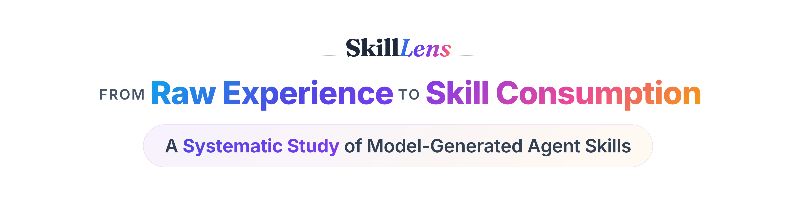
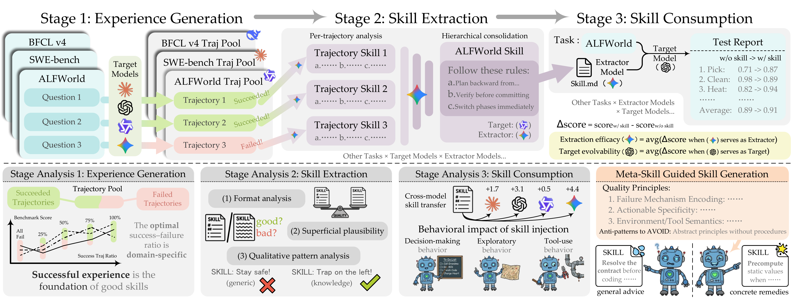

<div align="center">



[](https://microsoft.github.io/SkillLens/)
[](https://arxiv.org/abs/2605.23899)
[](LICENSE)
[](https://www.python.org/)

</div>

## ✨ Overview

<p align="center">
  
</p>

**Skill***Lens* is a framework for systematically studying *model-generated agent skills* across their full lifecycle: **experience generation → skill extraction → skill consumption**. It is built to answer the core question:

> *What makes model-generated skills actually useful to a target model, and what drives skill utility across the experience → extraction → consumption lifecycle?*

The framework provides:

- 🧪 **Unified trajectory loading** across five agent benchmarks (SWE-bench, ALFWorld, SpreadsheetBench, BFCL v4, SEAL-0)
- ⚙️ **Two extraction methods** — `sequential` (single-pass baseline) and `parallel` (per-trajectory mode extraction + hierarchical merge, the primary method in the paper)
- 🚀 **Unified inference CLI** (`skilllens infer`) that runs any benchmark with or without skill injection
- 📊 **Reproducible evaluation pipeline** for *Extraction Efficacy* and *Target Evolvability* metrics


## 🚀 Quick Start

```bash
# 1. Clone & install
git clone https://github.com/microsoft/SkillLens.git && cd SkillLens
conda create -n skilllens python=3.10 -y && conda activate skilllens
pip install -e ".[all]"

# 2. Configure your LLM provider
cp .env.example .env
# Edit .env — set OPENAI_API_KEY, or AZURE_OPENAI_ENDPOINT + (AZURE_OPENAI_API_KEY | AZURE_CLIENT_ID)

# 3. Pick a benchmark and run the 4-stage pipeline (ALFWorld as example)
bash scripts/setup_alfworld.sh                                  # one-time data setup

# (a) Raw experience generation
python -m skilllens infer --benchmark alfworld --model gpt-5.4 \
    --num-rounds 1 --workers 16

# (b) Schema normalization (raw → unified Trajectory)
python -m skilllens convert \
    --trajectory-dir inference_output/alfworld/<run-dir> \
    --benchmark alfworld --model-name gpt-5.4 \
    -o data/experience_pool/alfworld/my_pool.json

# (c) Skill extraction
python -m skilllens extract \
    -c configs/examples/alfworld_parallel.yaml \
    -i data/experience_pool/alfworld/my_pool.json \
    -o extraction_output/alfworld_parallel/

# (d) Skill consumption
SKILL=$(find extraction_output/alfworld_parallel -name skill_set.json | head -1)
python -m skilllens infer --benchmark alfworld --model gpt-5.4 \
    --num-rounds 1 --workers 16 --skill-set "$SKILL"
```

Per-benchmark prerequisites (data downloads, sandboxes, tool servers) live in each benchmark's README — see the [table below](#-benchmarks).


## 🧩 Pipeline

SkillLens organizes every experiment as **four stages**. Each stage has a corresponding CLI subcommand.

| Stage | Subcommand | What it does |
|------|-----------|--------------|
| **1. Raw experience generation** | `skilllens infer` | Runs the agent on the benchmark and writes raw trajectories. |
| **2. Schema normalization** | `skilllens convert` | Converts raw runner outputs into the unified `Trajectory` JSON schema. |
| **3. Skill extraction** | `skilllens extract` | Distills the experience pool into a `skill_set.json` (sequential or parallel method). |
| **4. Skill consumption** | `skilllens infer --skill-set` | Re-runs the target model on the same benchmark with the extracted skills injected. |


## 📚 Benchmarks

SkillLens ships integrations for five benchmarks. Each one has its own README with the exact prerequisites and step-by-step commands.

| Benchmark | Domain | Details |
|-----------|--------|---------|
| **ALFWorld** | Text-based household navigation | [`skilllens/benchmarks/alfworld/README.md`](skilllens/benchmarks/alfworld/README.md) |
| **BFCL v4** | Multi-turn function calling | [`skilllens/benchmarks/bfcl/README.md`](skilllens/benchmarks/bfcl/README.md) |
| **SEAL-0** | Web-research agent (LiteResearcher) | [`skilllens/benchmarks/seal0/README.md`](skilllens/benchmarks/seal0/README.md) |
| **SpreadsheetBench** | Excel manipulation in a sandboxed Jupyter kernel | [`skilllens/benchmarks/spreadsheetbench/README.md`](skilllens/benchmarks/spreadsheetbench/README.md) |
| **SWE-bench Verified** | GitHub bug fixing inside per-task containers | [`skilllens/benchmarks/swebench/README.md`](skilllens/benchmarks/swebench/README.md) |

For all benchmarks, the held-out test split is committed under `data/test_pool/<benchmark>/`.


## ⚙️ Configuration

YAML configs (`configs/example.yaml`, `configs/examples/*.yaml`) describe each extraction run:

```yaml
llm:
  provider: "azure"            # openai | azure | vllm | gemini
  model: "gpt-5.4"

input:
  path: "data/experience_pool/alfworld/gpt54_baseline.json"
  benchmark: "alfworld"

extraction:
  method: "parallel"           # sequential | parallel
  batch_size: 0                # 0 = all trajectories in one batch
  merge_group_size: 10
  max_concurrency: 32
  max_skills: 1
  max_skill_chars: 3000
  include_feedback: true
  max_modes_per_trajectory: 3
```

For Azure: set `AZURE_OPENAI_ENDPOINT` + (`AZURE_OPENAI_API_KEY` or `AZURE_CLIENT_ID` for Managed Identity) in `.env`. For per-model endpoint routing, set `AZURE_DEPLOYMENT_MAP` to a JSON dict mapping model name → `{endpoint, api_version}`.


## 📄 Citation

If you find SkillLens useful in your research, please cite:

```bibtex
@article{huang2026skilllens,
  title         = {From Raw Experience to Skill Consumption: A Systematic Study of Model-Generated Agent Skills},
  author        = {Zisu Huang and Jingwen Xu and Yifan Yang and Ziyang Gong and Qihao Yang and Muzhao Tian and Xiaohua Wang and Changze Lv and Xuemei Gao and Qi Dai and Bei Liu and Kai Qiu and Xue Yang and Dongdong Chen and Xiaoqing Zheng and Chong Luo},
  year          = {2026},
  journal       = {arXiv preprint arXiv:2605.23899},
  eprint        = {2605.23899},
  archivePrefix = {arXiv},
  url           = {https://arxiv.org/abs/2605.23899}
}
```


## 🤝 Contributing

This project welcomes contributions and suggestions. Most contributions require you to agree to a Contributor License Agreement (CLA) declaring that you have the right to, and actually do, grant us the rights to use your contribution. For details, visit [https://cla.opensource.microsoft.com](https://cla.opensource.microsoft.com).

This project has adopted the [Microsoft Open Source Code of Conduct](https://opensource.microsoft.com/codeofconduct/). For more information see the [Code of Conduct FAQ](https://opensource.microsoft.com/codeofconduct/faq/) or contact [opencode@microsoft.com](mailto:opencode@microsoft.com) with any additional questions or comments.

## 📬 Support & Security

- **Support:** see [SUPPORT.md](SUPPORT.md)
- **Reporting security issues:** see [SECURITY.md](SECURITY.md)

## 📜 License

This project is released under the [MIT License](LICENSE).

## ™️ Trademarks

This project may contain trademarks or logos for projects, products, or services. Authorized use of Microsoft trademarks or logos is subject to and must follow [Microsoft's Trademark & Brand Guidelines](https://www.microsoft.com/en-us/legal/intellectualproperty/trademarks/usage/general). Use of Microsoft trademarks or logos in modified versions of this project must not cause confusion or imply Microsoft sponsorship. Any use of third-party trademarks or logos are subject to those third-party's policies.
